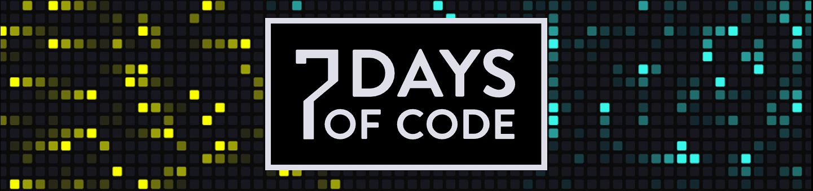

# Alura - 7 Days of Code - Dados - Ciência de Dados

Durante os 7 Days de Ciência de Dados você vai passar por todo ciclo de coleta, limpeza, tratamento, exploração e análise de dados. 
Nesses próximos 7 dias você vai entrar em uma base de dados do governo, trazer esses dados para o ambiente de análise 
utilizar SQL, Python, Pandas, Plotly entre outra ferramentas comuns no dia a dia de alguém que trabalha na área. 
No final, você vai ter uma visão ampla de diversos processos dentro da área e conseguirá entender como cada uma das etapas 
se encaixa no processo de análise de dados.

## Objetivo
O objetivo será analisar o dataset do CEAPS, que contém as cotas parlamentares dos Senadores do Brasil.

## Atividades
Dia 1:
- Baixar os dados de [CEAPS](https://www12.senado.leg.br/transparencia/dados-abertos-transparencia/dados-abertos-ceaps) de 2018 a 2022 e colocar na pasta "dados".
- Carregar os dados de todos os arquivos em um único dataframe.
- Cria profile dos dados.

## Referências
Alura - 7 Days of Code - Dados - Ciência de Dados:
https://7daysofcode.io/matricula/data-science
 , acessado em 20/09/2023.

Senado - Dados aberto - CEAPS:
https://www12.senado.leg.br/transparencia/dados-abertos-transparencia/dados-abertos-ceaps
 , acessado em 06/10/2023.

Brasil.io: https://brasil.io/manifesto/
 , acessado em 06/10/2023.

Tableau - Guide To Data Cleaning: Definition, Benefits, Components, And How To Clean Your Data:
https://www.tableau.com/learn/articles/what-is-data-cleaning
 , acessado em 06/10/2023.